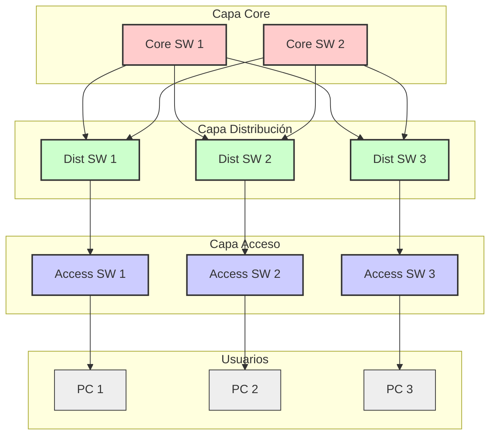
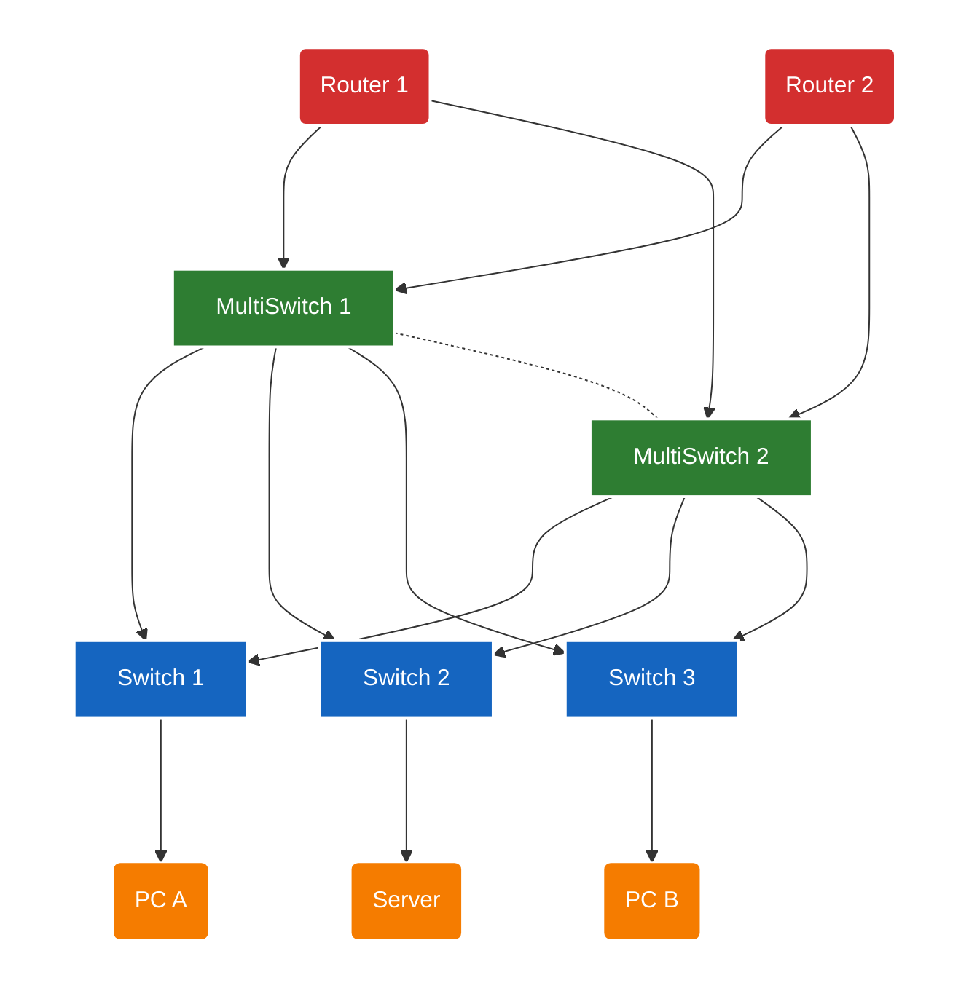

# Topologias de red
---
> [!info] 
> Una topología de red describe cómo están organizados y conectados los dispositivos en una red. Incluye topología física, topología lógica y los modelos de diseño LAN como el jerárquico de 2 y 3 capas.
## ¿Que es una topología?
La **topología** es la forma en la que se diseñan y conectan las redes. Se divide en:
- **Topología física**: Como están conectados los dispositivos fisicamente (cables, fibra, switches).
- **Topología lógica**: Como fluye el tráfico realmente (VLANs, STP, rutas, broascast domains).
## Modelos de diseño LAN
Un modelo de diseño [[Network_conceptos#^a80a01|LAN]] es una forma estructurada de organizar la red interna de una empresa. Cisco propone modelos con capas para separar funciones, mejorar rendimiento y facilitar el crecimiento de la red. Los beneficios son:
- Escalabilidad
- Redundancia 
- Estabilidad
- Fácil solución de problemas
- Aislamiento de fallos
- Estandarización
### Modelo de 3 capas (Jerarquico)
--- start-multi-column: ID_x03n
```column-settings
Number of Columns: 3
Largest Column: standard
```

**Core (Núcleo)** 
- Alta velocidad y baja latencia.
- Grandes volúmenes de trabajo.
- Totalmente redundante.
- Sin políticas pesadas (No [[Network_conceptos#^4dadad|ACLs]] complejas).

--- column-break ---

**Distribución**
- Une acceso $\leftrightarrow$ core
- Aplica politicas (ACLs, QoS).
- Maneja inter-VLAN routing.
- Aísla fallos del acceso.

--- column-break ---

**Acceso**
- Donde se conectan los dispositivos
- Switches de acceso y APs
- Funciones como VLANs, PoE...
- Es en esta capa donde se suministra energía a los dispositivos finales (Teléfonos, APs) mediante **[[Power_over_Ethernet_PoE|PoE]]**.


--- end-multi-column
El **Modelo 3 Capas (Tradicional)** esta diseñado para tráfico **North-South** (Norte-Sur). El usuario (Acceso) quiere salir a Internet (Core/Edge). El tráfico sube y baja.


### Modelo de 2 capas (Collapsed core)
El core (núcleo) y la distribución se combinan en un único nivel.
--- start-multi-column: ID_xv4s
```column-settings
Number of Columns: 3
Largest Column: standard
```

Utilizado en:
- PYMES
- Campus pequeños
- Edificios con poco trafico interno

--- column-break ---

<font color="#00b050">Ventajas</font>
- Más simple
- Más económico
- Menos equipo

--- column-break ---

<font color="#ff0000">Desventajas</font>
- Menos escalable
- Menos redundante que el modelo de 3 capas

--- end-multi-column
>[!tip] Evolución
>Incialmente el modelo en 3 capas era muy utilizado, pero a medida que los equipos se volvieron más potentes, las capas se "fusionaron" dando lugar a redes mas planas, redes mas planas, menos necesidad de un core dedicado.

![[Pasted image 20251127185419.png]]

## Arquitectura Spine-Leaf

> [!info]
> Arquitectura moderna usada principalmente en centros de datos. Ofrece caminos de igual coste, baja latencia y gran escalabilidad.

--- start-multi-column: ID_zii6
```column-settings
Number of Columns: 2
Largest Column: standard
```

**Como funciona**
- Todos los **Leaf** se conectan a todos los spine
- Los Lead no se conectan entre sí
- Los Spine no se conectan entre sí
- Cada servidor se conecta a un switch Leaf
- Permite expansión horizontal añadiendo más Leaf

--- column-break ---

<font color="#00b050">Ventajas</font>
- Latencia uniforme
- Alta escalabilidad
- Red muy estable
- Ideal para cargas distribuidas (virtualización, contenedores, VMs)

--- end-multi-column
El **Spine-Leaf (Data Center)** esta Diseñado para tráfico **East-West** (Este-Oeste). Los servidores (virtualización/contenedores) hablan mucho entre ellos. El tráfico se mueve lateralmente.
[
## **Resumen final**

> [!info]
El modelo jerárquico LAN permite crear redes más rápidas, estables y fáciles de gestionar.
Según la escala, se aplica 2 capas, 3 capas o topologías modernas como spine–leaf.

---
**Tags:** #CCNA/Fundamentos #Diseño/LAN #Arquitectura/Tier-3 #Arquitectura/Spine-Leaf